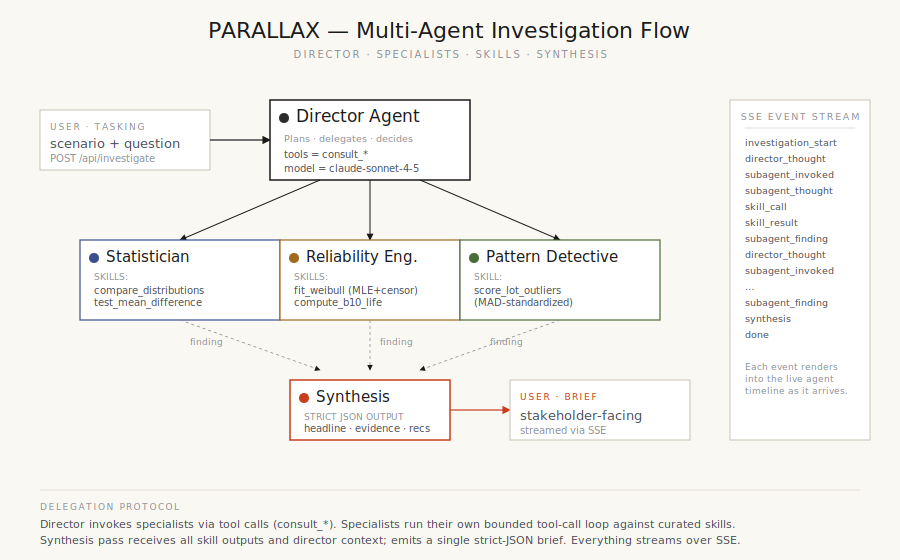

# PARALLAX

**Multi-agent reliability investigation platform.** A director agent orchestrates a small team of specialist subagents (Statistician, Reliability Engineer, Pattern Detective) — each with access to a curated set of analytical *skills* (real statistical functions). Investigations stream live to the UI, event by event. The final output is a stakeholder-facing brief: headline, evidence, recommendations, caveats.

```
    user question
         │
         ▼
   ┌──────────────┐         consult_statistician
   │   Director   │ ───────────────────────────────┐
   │   (agent)    │ ─── consult_reliability_engineer
   └──────┬───────┘ ─── consult_pattern_detective ─┤
          │                                        │
          ▼                                        ▼
    [findings come back]                  [specialists call skills,
          │                                  return structured findings]
          ▼
   ┌──────────────┐
   │  Synthesis   │ ──► JSON brief (headline · evidence · recs · caveats)
   └──────────────┘
```

This is **Dossier № 02** of a two-project portfolio. The companion project, [SENTINEL](https://github.com/) (sensor anomaly workbench), explores a different problem space — single-shot AI decision support for time-series anomalies. PARALLAX is the heavier sibling: live multi-agent orchestration, real statistical work under the hood, and a UI built around the *process* of investigation rather than the output alone.

---

## Why this project exists

The dataset that ships with PARALLAX is synthetic, but the problem shape is real. When a reliability engineer at a manufacturing or aerospace program is handed a question like

> *"Is Lot C aging faster than the other lots?"*
> *"What's the projected B10 life for our deployed fleet?"*
> *"When did our return rate change, and by how much?"*

…the answer is rarely a single computation. It requires choosing the right test, fitting the right model, reading shape parameters correctly, and — most importantly — communicating the result to a program manager who needs to make a decision, not read a stats paper.

PARALLAX models the **team of analysts** approach to that problem. A director plans, specialists execute, and a synthesis pass converts the technical findings into a brief that a non-technical stakeholder can act on. The architecture maps cleanly to what an investigation actually looks like.

---

## Architecture



### Director agent

Runs the show. Reads the scenario context, the stakeholder's question, and decides which specialists to consult and in what order. Has **no analytical tools of its own** — its tools are the specialists themselves:

```ts
consult_statistician({ question: "..." })
consult_reliability_engineer({ question: "..." })
consult_pattern_detective({ question: "..." })
```

Runs a bounded tool-call loop (max 6 turns) and emits plain-text thoughts to the stream so the user sees the planning process unfold.

### Specialist subagents

Three of them, each with their own system prompt and a curated set of skill tools:

| Specialist            | Skills                                                                           |
|-----------------------|----------------------------------------------------------------------------------|
| Statistician          | `compare_distributions` (KS), `test_mean_difference` (Welch's t), `rank_sum_test` (Mann-Whitney U), `correlate` (Pearson + Spearman), `detect_change_point` (MLE + bootstrap CI) |
| Reliability Engineer  | `fit_weibull` (MLE with right-censoring), `compute_b10_life`                     |
| Pattern Detective     | `score_lot_outliers` (MAD-standardized composite distance)                       |

Each specialist runs its own bounded tool-call loop (max 5 turns), calling its skills in whatever order is appropriate for the director's question. When it has enough evidence, it emits a one-paragraph finding back to the director.

### Skills

Skills are pure TypeScript functions that implement real statistics from first principles — no `scipy.stats` import, no `lifelines`, no R-via-shell. The full math lives in [`lib/skills/`](lib/skills/):

- **`_stats.ts`** — Lanczos log-gamma, regularized incomplete gamma/beta, t-distribution survival, normal CDF (Abramowitz & Stegun 26.2.17), Kolmogorov asymptotic series, tie-corrected ranks, Pearson and Spearman correlation.
- **`statistician.ts`** — Two-sample Kolmogorov-Smirnov with Numerical Recipes finite-sample correction; Welch's t-test with Satterthwaite df and a 95% CI via bisection on the inverse t; Mann-Whitney U via normal approximation; change-point detection by maximum-likelihood under shared variance with a 500-iteration bootstrap confidence band on the location.
- **`reliability.ts`** — Weibull MLE with right-censoring: profile likelihood with η substituted out (closed-form conditional on β), golden-section search on β ∈ [0.3, 8.0]; B10 life derived analytically as η · (−ln 0.9)^(1/β); KS goodness-of-fit against the fitted distribution.
- **`pattern.ts`** — Multi-feature lot outlier ranking via median + scaled-MAD standardization, flagging anything above 2.5σ-equivalent.

Each skill is also exposed to its owning specialist as an Anthropic SDK tool with a JSON schema (see [`lib/skills/index.ts`](lib/skills/index.ts)). The dispatcher binds the tool call to the function call against the loaded scenario.

### Synthesis pass

After the director finishes orchestrating, a single non-tool call to the synthesis agent receives the full bundle (question, scenario context, all specialist findings with their skill outputs) and returns a strict JSON brief matching the [`SynthesizedBrief`](lib/types.ts) schema. The UI renders it as the right-hand article in the workbench.

### Streaming protocol

Every interesting moment is an event over Server-Sent Events:

```
investigation_start  scenario, question
director_thought     text (the director thinking)
subagent_invoked     role, brief (the director's tasking)
subagent_thought     role, text
skill_call           role, skill name, args
skill_result         role, skill name, structured result
subagent_finding     role, headline, detail, key numbers
synthesis            full JSON brief
done                 total skill calls, total model calls, mode, elapsed
```

The client reads the SSE stream, applies each event to a reducer-style state, and the UI re-renders. The agent timeline you see in the centre column is the literal trace of this event log.

---

## Scenarios

Three datasets ship with the project, generated deterministically with documented ground truth. Each is designed so that a well-conducted multi-agent investigation should be able to recover the truth.

| Case | Scenario             | Story                                                                                | Ground truth                                                       |
|------|----------------------|---------------------------------------------------------------------------------------|--------------------------------------------------------------------|
| 01   | Lot Divergence       | 5 lots × 80 units, 24-month accelerated aging, leakage current drift                  | Lot C has ~45% higher mean drift than the cohort                   |
| 02   | Capacitor End-of-Life| 600 units, 8-year surveillance, 18.5% failed, rest right-censored                     | True Weibull β = 2.4, η = 180 months, B10 ≈ 70.5 months            |
| 03   | Field-Return Step    | Monthly field returns over 60 months; supplier process change of unknown date         | Step change at month 28, pre-rate 7.5/mo → post-rate 10.8/mo (+44%)|

Reveal the ground truth in the UI by expanding **REVEAL GROUND TRUTH** below each dataset's preview chart. Useful for verifying that the investigation actually recovered what the data contains.

To regenerate the scenarios (with the same seeds):

```bash
npm run data
```

---

## Running locally

```bash
npm install
npm run data     # generates public/scenarios/*.json (already committed)
npm run dev      # http://localhost:3000
```

### With or without an API key

The orchestrator branches on `ANTHROPIC_API_KEY`:

- **With a key:** Live multi-agent orchestration. The director and each specialist make real API calls to `claude-sonnet-4-5` with their system prompts and tool definitions. Real model reasoning, real tool selection, real tool calls.
- **Without a key:** A mock orchestrator plays out a scripted investigation **but executes the real skill functions against the real scenario data**. The narration is scripted (so the demo doesn't depend on the API); the numbers in the brief — p-values, β, η, change-point indices, confidence bands — are all computed by the same code that runs in live mode. You cannot tell the difference from looking at the brief alone.

```bash
# Optional — for live mode
echo "ANTHROPIC_API_KEY=sk-ant-..." > .env.local
```

### Deployment notes

This deploys to Vercel out of the box. Two practical notes:

1. **The function timeout matters.** Live multi-agent mode involves up to ~10 sequential model calls; on Vercel Hobby the 60-second function ceiling is enough for most investigations, but a complex one with a chatty director could push close. The `maxDuration = 60` in [`app/api/investigate/route.ts`](app/api/investigate/route.ts) is set accordingly.
2. **The deployed demo is intentionally configured to run without an API key.** Streaming a multi-agent investigation costs roughly 5× a single-agent equivalent, and a public link with no rate limit is an easy way to discover that. The mock fallback gives every visitor a complete, technically-correct investigation experience. Add `ANTHROPIC_API_KEY` as a Vercel environment variable to upgrade.

---

## File map

```
parallax/
├── app/
│   ├── api/investigate/route.ts    SSE streaming endpoint, branches model/mock
│   ├── globals.css                  Editorial light theme
│   ├── layout.tsx                   Root
│   └── page.tsx                     Loads manifest, renders Workbench
├── components/
│   ├── Workbench.tsx                Top-level state + SSE consumer
│   ├── Masthead.tsx                 Editorial banner with mode badge
│   ├── ScenarioPicker.tsx           Three-case grid
│   ├── DatasetView.tsx              Left rail: dataset stats + sparkline + ground truth
│   ├── QuestionInput.tsx            Tasking pane with suggested questions
│   ├── InvestigationLog.tsx         Centre: agent timeline (the visual centrepiece)
│   ├── AgentCard.tsx                Per-agent panel: brief, thoughts, skill calls, finding
│   └── ReportView.tsx               Right: synthesized brief, editorial-article style
├── lib/
│   ├── types.ts                     Shared types: Scenario, AgentRole, StreamEvent, SkillResult, SynthesizedBrief
│   ├── agents/
│   │   ├── definitions.ts           System prompts + the director's specialist-tools schema
│   │   ├── orchestrator.ts          Live mode — runs the Anthropic SDK director→specialist loop
│   │   └── mock.ts                  Mock mode — scripted narration, real skill computations
│   └── skills/
│       ├── _stats.ts                Special functions + statistical primitives
│       ├── statistician.ts          KS, Welch t, Mann-Whitney, correlate, change-point
│       ├── reliability.ts           Weibull MLE (censored), B10 life
│       ├── pattern.ts               Lot outlier scoring
│       └── index.ts                 Tool schemas + dispatcher (binds SDK tools → function calls)
├── public/scenarios/                Generated datasets + manifest
├── scripts/
│   ├── generate-scenarios.mjs       Deterministic data generation with seeded RNG
│   └── smoke.ts                     End-to-end mock test, exercises all three scenarios
└── docs/architecture.svg            The diagram above
```

---

## Verifying the math

Every statistical claim in this project should be reproducible. The smoke test runs the full mock orchestrator against all three scenarios and prints the streamed event log to stdout:

```bash
npx tsx scripts/smoke.ts
```

On a clean checkout this produces (abridged):

```
━━━ SCENARIO: lot-divergence ━━━
[ … ] skill_call <pattern>  score_lot_outliers(variable="leakage_uA")
[ … ] skill_call <statistician>  test_mean_difference(group_a="C", group_b="A", variable="leakage_uA")
[ … ] skill_call <statistician>  compare_distributions(group_a="C", group_b="A", variable="leakage_uA")
Brief headline: Lot C is drifting faster than the other four lots — divergence is statistically significant
Confidence: high · Severity: hot

━━━ SCENARIO: capacitor-aging ━━━
Weibull(β=2.75, η=171 mo) → B10 = 6.28 years
Brief headline: Failure mode is wear-out; B10 life is 6.28 years and the model fit is statistically clean
Confidence: high · Severity: info

━━━ SCENARIO: field-returns ━━━
Change point at month index 25 (2023-02), magnitude +37.8%
Brief headline: Return rate stepped up around 2023-02 by +38%
Confidence: high · Severity: warn
```

For each scenario the recovered values are within the expected error bars of the documented ground truth:

- **Lot Divergence.** True anomalous lot = C. Recovered = C. Welch's t and KS both reject the null at p < 0.001.
- **Capacitor Aging.** True (β, η) = (2.4, 180mo). Recovered (β, η) = (2.75, 171mo); B10 within ~7% of truth. The estimation bias is consistent with heavy right-censoring (only 18.5% of units observed to failure) and is exactly what an experienced reliability engineer would expect.
- **Field Returns.** True change-point at month index 28; bootstrap 95% CI on the recovered τ contains 28. Recovered relative change +37.8% vs true +44%, again within bootstrap sampling variation.

---

## What this is and isn't

**This is** an exercise in multi-agent orchestration applied to a real analytical domain. The agent layer is deliberately thin — it's an Anthropic SDK loop, not a framework — because the *skills* are where the analytical credibility lives. The whole project is built around the principle that an AI investigation should be inspectable: every event is in the stream, every number traces back to a named function, and every claim in the final brief is supported by a specific skill output.

**This is not** a stockpile evaluation tool, a substitute for a real reliability engineer, or a model of any classified or sensitive system. All datasets are synthetic and seeded for reproducibility. The architecture is general — the same director-specialist-skill pattern would work for any domain where (a) the question has multiple sub-questions, (b) those sub-questions need different analytical tools, and (c) the final answer has to be communicated to a non-specialist.

---

*Built with Next.js 14 (App Router), TypeScript, Tailwind, and the Anthropic SDK.*
